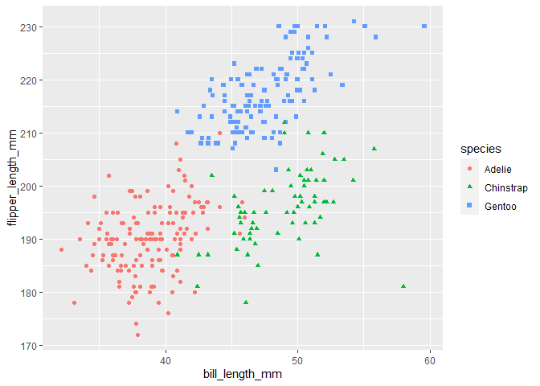

p8105\_hw1\_mgg2153
================
mggn
9/16/2020

## P8105 Homework 1

``` r
library(tidyverse)
```

    ## -- Attaching packages ---------------------------------------------------------------------------------------------- tidyverse 1.3.0 --

    ## v ggplot2 3.3.2     v purrr   0.3.4
    ## v tibble  3.0.3     v dplyr   1.0.2
    ## v tidyr   1.1.2     v stringr 1.4.0
    ## v readr   1.3.1     v forcats 0.5.0

    ## -- Conflicts ------------------------------------------------------------------------------------------------- tidyverse_conflicts() --
    ## x dplyr::filter() masks stats::filter()
    ## x dplyr::lag()    masks stats::lag()

### Problem 1

First, load the tidyverse library and create a dataframe using tibble

``` r
mg_dataf = 
  tibble(
    samp = rnorm(10),
    vec_logical = as.logical(samp > 0),
    vec_char = c("Hello", "world", "I", "am", "Maria", "and", "Frankie", "is","my", "pug"),
    factor_vec = factor(c("noun", "noun", "noun", "verb", "noun", "noun", "noun", "verb", "adj", "noun"))
  )
```

Then, I want to take the mean of each variable in my data frame. the
purpose is to see how R treats different variable types, and what
happens when you try to take the mean of these different variable types.

``` r
mean(pull(mg_dataf, samp))
```

    ## [1] -0.3063411

``` r
mean(pull(mg_dataf, vec_logical))
```

    ## [1] 0.4

``` r
mean(pull(mg_dataf, vec_char))
```

    ## Warning in mean.default(pull(mg_dataf, vec_char)): argument is not numeric or
    ## logical: returning NA

    ## [1] NA

``` r
mean(pull(mg_dataf, factor_vec))
```

    ## Warning in mean.default(pull(mg_dataf, factor_vec)): argument is not numeric or
    ## logical: returning NA

    ## [1] NA

I can take the mean of my numeric and logical variables, but not of the
character or factor variables.Using the code below, we can try to
convert the non-numeric types into numeric variables:

``` r
as.numeric(pull(mg_dataf, vec_logical))
as.numeric(pull(mg_dataf, vec_char))
as.numeric(pull(mg_dataf, factor_vec))
```

And below, we can use the code to try and convert:  
\* logical type to numeric, and multiplying by a numeric variable  
\* logical to factor, and multiplying by a numeric variable  
\* logical to factor to numeric, and multiply by a numeric variable

``` r
as.numeric(pull(mg_dataf, vec_logical))*(pull(mg_dataf, samp))
```

    ##  [1] 0.0000000 0.0000000 0.0000000 0.3331352 0.0000000 1.0429245 1.0718817
    ##  [8] 0.0000000 0.4982349 0.0000000

``` r
as.factor(pull(mg_dataf, vec_logical))*(pull(mg_dataf, samp))
```

    ## Warning in Ops.factor(as.factor(pull(mg_dataf, vec_logical)), (pull(mg_dataf, :
    ## '*' not meaningful for factors

    ##  [1] NA NA NA NA NA NA NA NA NA NA

``` r
as.numeric(as.factor(pull(mg_dataf, vec_logical)))*(pull(mg_dataf, samp))
```

    ##  [1] -0.2034322 -1.7398046 -0.7457069  0.6662703 -1.6638598  2.0858490
    ##  [7]  2.1437634 -0.2305806  0.9964697 -1.4262026

### Problem 2 - Penguins\!

First, I want to load the penguins package per instruction on HW1.

``` r
data("penguins", package = "palmerpenguins")
```

#### Overview: penguins dataset

The penguins dataset has 344 observations and 8 variables, which are:
species, island, bill\_length\_mm, bill\_depth\_mm, flipper\_length\_mm,
body\_mass\_g, sex, year.

There are are three factor variables which are species, factor, and sex.

For variable species, the categories are Adelie, Chinstrap, Gentoo. For
variable island, the categories are Biscoe, Dream, Torgersen. For
variable sex, the categories are female, male.

The other five variables are numeric types, which are summarized below:

flipper\_length\_mm: the mean is **200.9152047**. the standard deviation
is 14.0617137.

bill\_length\_mm: the mean is 43.9219298. the standard deviation is
5.4595837.

bill\_depth\_mm: the mean is 17.1511696. the standard deviation is
1.9747932.

body\_mass\_g: the mean is 4201.754386. the standard deviation is
801.9545357.

year: the range of years in the dataset is from 2007 to 2009.

### Scatterplot of bill length vs flipper length

We are looking at how these two variables behave:

``` r
ggplot(data = penguins, 
                       aes(x = bill_length_mm,
                           y = flipper_length_mm)) +
  geom_point(aes(color = species, 
                 shape = species)
  )
```

    ## Warning: Removed 2 rows containing missing values (geom_point).

<!-- -->
